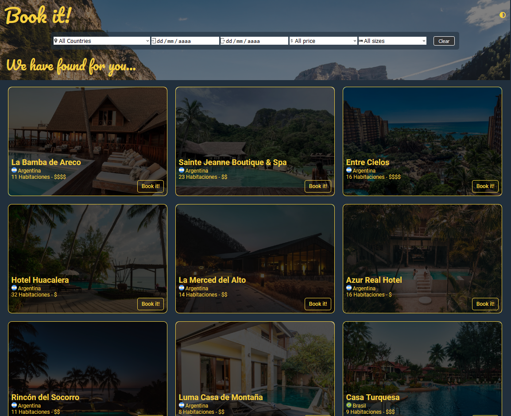
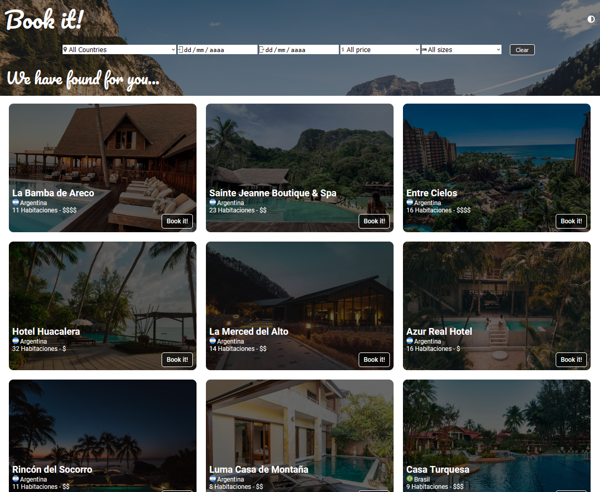
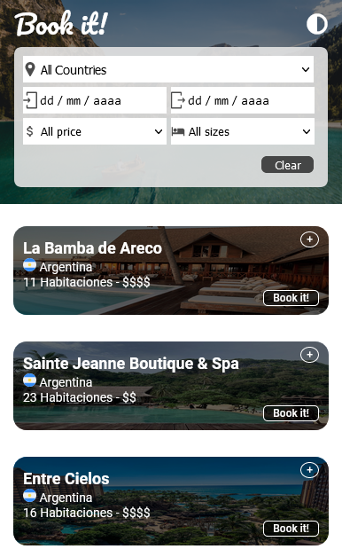

# Hotel Booking Project

The hotel Booking Project is the final challenge for the sprint #2 of Semillero de Desarrolladores, The goal of this challenge is to create a web app who allow users to search for hotels using different filters (Country, Check IN and Check Out dates, prices and size), so the user can see the selected hotels anytime a filter is applied.

From a technical point of view, the goal of the challenge, is to use all the different tools and knowledge acquired to create the app, so in the end we need to use html, css and vanilla javascript to complete the challenge.

This challenge allow us to get acquainted to DOM Manipulation and array manipulation using only vanilla javascript and improve our abilities with CSS.

Dark Mode

Light Mode

Mobile

The web was built based on the backlog and Figma documents provided, also the data was extracted from API provided.

To run the project:

- Clone this repo
- Start an empty workspace on Vscode
- Add the project to the workspace
- Run a liveServer instance
- Now on the web browser should appear the project running

## Live Demo
live version at : https://neo-rxn.github.io/Sprint2-Challenge/
